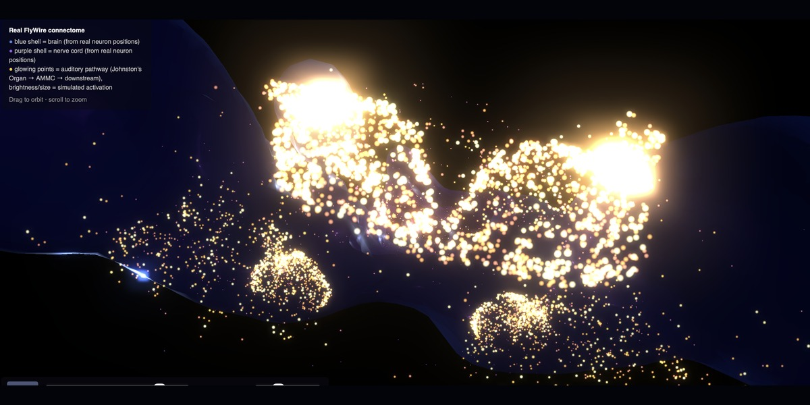
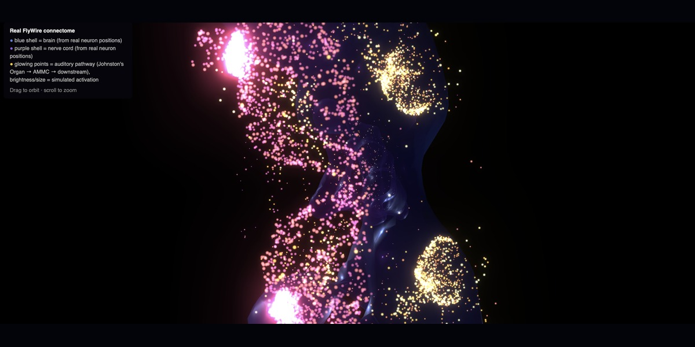
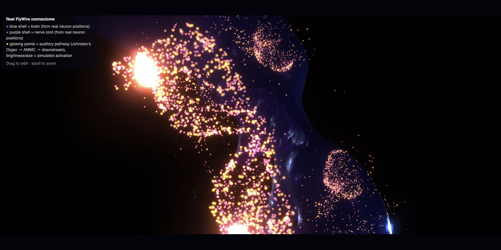
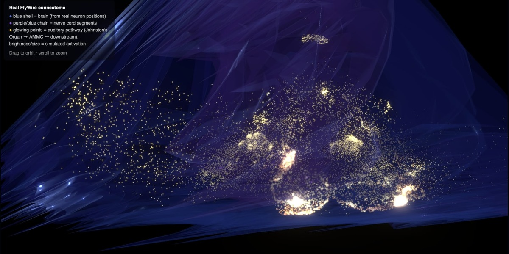
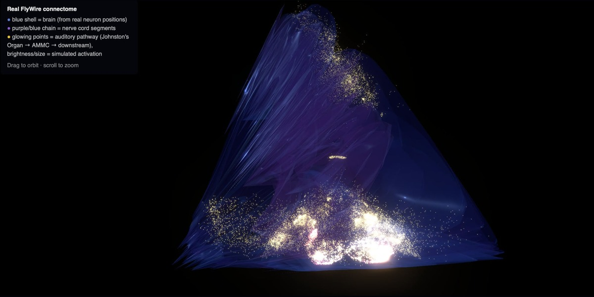

# Fly Brain on Music

<div align="center">

[](https://fly-brain-on-music-xbu8eqftdnxbxupgxbga8z.streamlit.app)     

</div>

Ever wondered what a fly's brain looks like while listening to music?

A fruit fly's brain has about 23,000 neurons on its auditory pathway alone, wired by roughly 76,000 real synapses. This project plays it music.

> The wiring is real. What the music means to it is not, and the project says so plainly.

The wiring diagram comes from [FlyWire](https://flywire.ai) and [CAVE](https://www.cave-connectome.org), a real, complete map of a fly brain down to the individual synapse. Drop in a track, and it drives a real simulation of neurons firing and passing signals to each other, using the same equations and settings that [a published brain model](https://www.nature.com/articles/s41586-024-07763-9) used on this same map. The neurons are real. The synapses are real. What renders afterward is an interactive, audio-synced 3D scene, built from each neuron's true position in the brain.

The one part that is not science is the bridge from sound to synapse. No dataset of a fly's real neural response to music exists, so that mapping, loudness and onset and frequency energy translated into synaptic current, is an artistic choice, not a validated model. Call this connectome-constrained generative art, not a claim about how flies hear Chopin. The app's own "About this project" panel draws the line between the two, item by item.

<p align="center">
  <a href="https://fly-brain-on-music-xbu8eqftdnxbxupgxbga8z.streamlit.app"><b>Try it live</b></a>
</p>

<p align="center">
  
</p>

<table align="center">
  <tr>
    <td></td>
    <td></td>
  </tr>
</table>

<table align="center">
  <tr>
    <td></td>
    <td></td>
  </tr>
</table>

<p align="center">
  <video src="https://github.com/user-attachments/assets/9936f52c-4505-4f35-9957-4152a2787bd8" controls width="90%"></video>
</p>

## What's real vs. speculative

**Real, from published data:**
- **The wiring.** Real neurons, real synapses, real 3D positions, all from the FlyWire/CAVE map of a fly brain. Specifically, every neuron within three steps of the fly's hearing organ and everything it connects to downstream. [Read about the dataset](https://www.cave-connectome.org)
- **Which neurons excite and which calm things down.** Each neuron's chemical signal type decides whether it switches other neurons on or off, following the same rules the actual research uses. [Read the paper](https://www.nature.com/articles/s41586-024-07763-9)
- **How neurons fire.** A real, published model of how a neuron builds up charge and fires, run on this same wiring diagram by actual researchers. [Read the paper](https://www.nature.com/articles/s41586-024-07763-9)

**Speculative, our own modeling layer:**
- **Turning sound into a signal the neurons receive.** No one has ever measured how a fly's brain actually responds to music, so this mapping (how loud, how sudden, which pitches) is our own artistic choice, not a validated model.
- **Splitting bass, mid, and treble across different neurons.** The public data has no record of which neurons respond to which pitch, so this grouping is made up, just consistent every time you run it.

## Try it

**[Open the live app](https://fly-brain-on-music-xbu8eqftdnxbxupgxbga8z.streamlit.app)**. A public-domain recording of Chopin's *Nocturne in E-flat major* is bundled in, so hit **Run simulation** and nothing more is required. White and pink noise are there too, for anyone who wants to see the thing twitch before trusting it with real music.

## Running locally

```bash
python3 -m venv venv
source venv/bin/activate
pip install -r requirements.txt
streamlit run src/app.py
```

The FlyWire connectome subgraph, neuron positions, and demo audio are already included in `data/`, so this works immediately. No CAVE account or auth token is needed just to run the app.

## Regenerating the data from scratch

Only needed if you want to rebuild the connectome subgraph yourself (different hop radius, synapse threshold, etc.) rather than use what's committed in `data/connectome/`.

```bash
pip install -r requirements-pipeline.txt
python src/get_token.py          # one-time: FlyWire/CAVE auth token
python src/check_auth.py         # verify it worked
python src/fetch_connectome.py   # pull the auditory-pathway subgraph
python src/fetch_coordinates.py  # real 3D neuron positions
python src/fetch_background_positions.py
python src/fetch_hull_meshes.py
```

Requires your own FlyWire/CAVE account. See [codex.flywire.ai](https://codex.flywire.ai).

## How it works

1. **`audio_features.py`** listens to the track: how loud, how fast, how sudden each moment is, and how much bass/mid/treble it has.
2. **`simulate.py`** feeds that into the real wiring diagram. Roughly 23,000 neurons pass the signal to each other, hop by hop, starting from the hearing organ and spreading outward, the same way a real nerve signal would travel. The module's own comments walk through the model in more depth for anyone curious.
3. **`web_scene.py`** and **`brain_map_3d.py`** draw the result: each neuron placed at its real position in the brain, glowing brighter as it fires, in sync with the track.
4. **`brain_map.py`** is a simple flat backup drawing (not the real 3D positions), kept on hand in case the real scene ever isn't wanted or available. It isn't part of the running app.

## Build story

It started as scaffolding only: pull a connectome, drive it with sound, see what happens. What actually happened was a season of dead ends and a few real discoveries that reshaped the project more than the original plan ever did.

Data access came first and refused to cooperate. CAVEclient authentication against FlyWire's production dataset was the intended path; it stalled, so the connectome got pulled by manual download instead, and the first real graph was built from that. Around the same time, an early assumption that audio files would live pre-stored, one per genre, got scrapped for a plain drag-and-drop uploader. Nothing stored, anyone's track welcome.

The visualization was a guess before it was a fact. With no 3D mesh data available from the public export, the first rendering was a hand-authored schematic, still alive today as `brain_map.py`, a fallback rather than the centerpiece it once had to be. The real thing turned up later in CAVE's `cell_representative_point` table: the true anatomical position of every neuron, sitting there the whole time, which is what finally unblocked a real 3D scene.

The single biggest improvement, by the development log's own account, was switching to real leaky integrate-and-fire dynamics. The activation model went through a generic recurrence formula and a few tanh-squashed approximations before landing on an actual LIF spiking model, then later adopting Shiu et al.'s exact published parameters for it, so the membrane time constant would be a number drawn from the literature and independently confirmed, not one picked because it looked reasonable.

Some of the fixes were real bugs, not just tuning: activation that snapped instantly instead of following the membrane dynamics, a centering bug from targeting a bounding box's midpoint instead of its center of mass, a simulation that worked fine on synthetic noise and stayed dead on real songs, and a geometry bug behind a brain hull shaped, for a while, like a blade. The auditory subgraph itself grew too, from two hops downstream of Johnston's Organ to three, the synapse-count threshold raised alongside it to keep the neuron count workable while reaching further into wiring that was real at every step.

What was left, once the simulation could be trusted, was making it legible: a Streamlit `session_state` bug that wiped the entire results view if you so much as touched another widget, a dark theme built to match the scene instead of clashing against Streamlit's default light UI, a loading indicator that nods to the real FlyWire and CAVE segmentation viewer, and finally moving the transport controls outside the 3D viewport instead of floating on top of it.

The unedited log lives in [`BUILD_LOG.md`](BUILD_LOG.md) if any of that is worth the full account.

## Credits

- Connectome data: [FlyWire](https://flywire.ai) / [CAVE](https://www.cave-connectome.org), BANC v888 dataset.
- LIF model parameters: Shiu et al. 2024, *Nature*, "A *Drosophila* computational brain model reveals sensorimotor processing."
- Neurotransmitter sign convention: Lappalainen et al. 2024, *Nature*; Hardie, 1989, *Nature*.
- Demo track: Chopin, *Nocturne in E-flat major, Op. 9 No. 2*, performed by Frank Levy, public domain (CC0) via [Wikimedia Commons](https://commons.wikimedia.org/wiki/File:Nocturneop9no2-.ogg).

## License

Code: MIT. See [LICENSE](LICENSE). The connectome data in `data/connectome/` is derived from FlyWire/CAVE and subject to [FlyWire's own data usage terms](https://codex.flywire.ai/api/download), not this repo's MIT license.

## Disclaimer

This is a speculative/artistic simulation, not a validated behavior predictor. The connectome and spiking model are real and cited; the audio-to-neuron-drive mapping and the resulting "behavior" are a modeling choice, not established science.

---

"I discovered in nature the nonutilitarian delights that I sought in art. Both were a form of magic, both were a game of intricate enchantment and deception." ― Vladimir Nabokov
