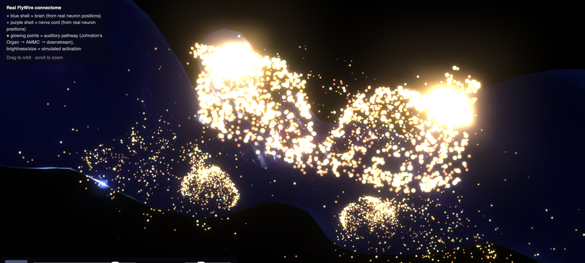
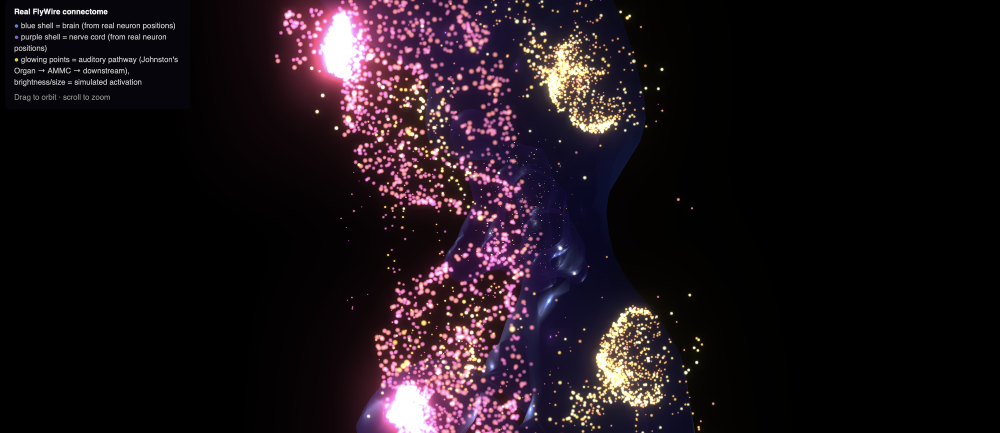
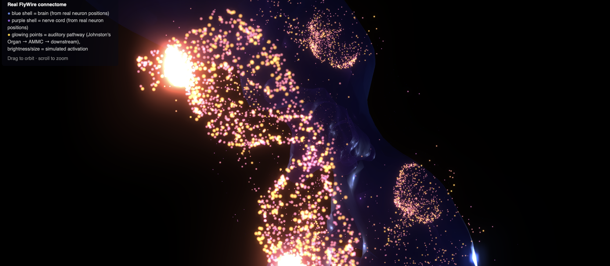

# Fly Brain on Music

Drop in a track and watch it propagate through a **real fruit fly connectome**.

This app maps audio onto the real FlyWire/CAVE **BANC v888** connectome (~23k neurons, ~76k real synaptic connections downstream of the fly's actual auditory sensory organ) and simulates activation with a real **leaky integrate-and-fire (LIF)** spiking model, using published parameters from Shiu et al. 2024, *Nature*. The result is rendered as an interactive, audio-synced 3D scene.

The wiring, the neurotransmitter signs, and the spiking dynamics are real, cited science. The audio-to-neural-drive mapping is our own artistic modeling layer — no dataset of real fly neural response to music exists to validate against. Treat this as **connectome-constrained generative art**, not a research claim about how flies perceive music. The app's own "About this project" panel spells out exactly what's real vs. speculative, line by line.

<p align="center">
  
</p>
<p align="center">
  
  
</p>

## What's real vs. speculative

**Real, from published data:**
- **Connectome** — FlyWire/CAVE's BANC v888 dataset: real neurons, real synapses, real 3D positions. The subgraph is every neuron within 3 hops downstream of Johnston's Organ (the fly's real auditory sensory organ) → AMMC, filtered to connections with ≥12 synapses.
- **Neurotransmitter identity & sign** — from each neuron's verified (preferred) or predicted NT type. Acetylcholine is excitatory; GABA, glutamate, and histamine are inhibitory — the glutamate/histamine calls follow the fly-specific convention (unlike vertebrate CNS) used in Lappalainen et al. 2024, *Nature*, and Hardie, 1989, *Nature*.
- **Neuron dynamics** — a real LIF model with published parameters from Shiu et al. 2024, *Nature*, a computational brain model built on this same connectome. Its membrane time constant (20ms) independently matches Gouwens & Wilson 2009's direct electrophysiological measurement.

**Speculative, our own modeling layer:**
- **Audio → neural drive** — loudness/onset/frequency-band energy mapped to synaptic current. An artistic choice, not a validated model.
- **"Tonotopic" band split** — FlyWire's public data has no per-neuron frequency-tuning annotation, so the bass/mid/treble seed grouping is a deterministic but arbitrary partition, not a real tonotopic map.

## Try it

A public-domain Chopin recording is bundled as the default demo track — just hit **Run simulation**, no upload needed. White/pink noise control tracks are also available for verifying the simulation reacts to input at all.

## Running locally

```bash
python3 -m venv venv
source venv/bin/activate
pip install -r requirements.txt
streamlit run src/app.py
```

The FlyWire connectome subgraph, neuron positions, and demo audio are already included in `data/`, so this works immediately — no CAVE account or auth token needed just to run the app.

## Regenerating the data from scratch

Only needed if you want to rebuild the connectome subgraph yourself (different hop radius, synapse threshold, etc.) rather than use what's committed in `data/connectome/`.

```bash
pip install -r requirements-pipeline.txt
python src/get_token.py          # one-time: FlyWire/CAVE auth token
python src/check_auth.py         # verify it worked
python src/fetch_connectome.py   # pull the auditory-pathway subgraph
python src/fetch_coordinates.py  # real 3D neuron positions
python src/fetch_background_positions.py
python src/fetch_hull_meshes.py
```

Requires your own FlyWire/CAVE account — see [codex.flywire.ai](https://codex.flywire.ai).

## How it works

1. **`audio_features.py`** — extracts tempo, RMS loudness, onset strength, and bass/mid/treble band energy from the uploaded track (librosa).
2. **`simulate.py`** — drives the real connectome graph with those features. Each of the ~23k neurons is a leaky integrate-and-fire unit; real synaptic weights (linear in synapse count, signed by neurotransmitter) propagate spikes hop by hop from the seed (Johnston's Organ) neurons outward. See the module docstring for the full model writeup, including the resolution trade-offs made for interactivity.
3. **`web_scene.py`** + **`brain_map_3d.py`** — renders the result as a three.js scene using each neuron's real 3D position (from CAVE), colored/sized by simulated activation, audio-synced frame by frame.
4. **`brain_map.py`** — a standalone, non-interactive 2D schematic fallback (hand-placed neuropil coordinates, not real 3D positions) — not wired into the app, kept as a lightweight backup visualization.

## Credits

- Connectome data: [FlyWire](https://flywire.ai) / [CAVE](https://www.cave-connectome.org), BANC v888 dataset.
- LIF model parameters: Shiu et al. 2024, *Nature*, "A *Drosophila* computational brain model reveals sensorimotor processing."
- Neurotransmitter sign convention: Lappalainen et al. 2024, *Nature*; Hardie, 1989, *Nature*.
- Demo track: Chopin, *Nocturne in E-flat major, Op. 9 No. 2*, performed by Frank Levy, public domain (CC0) via [Wikimedia Commons](https://commons.wikimedia.org/wiki/File:Nocturneop9no2-.ogg).

## License

Code: MIT — see [LICENSE](LICENSE). The connectome data in `data/connectome/` is derived from FlyWire/CAVE and subject to [FlyWire's own data usage terms](https://codex.flywire.ai/api/download), not this repo's MIT license.

## Disclaimer

This is a speculative/artistic simulation, not a validated behavior predictor. The connectome and spiking model are real and cited; the audio-to-neuron-drive mapping and the resulting "behavior" are a modeling choice, not established science.
