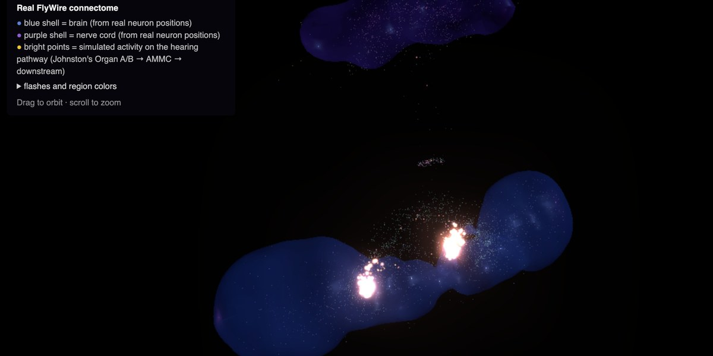
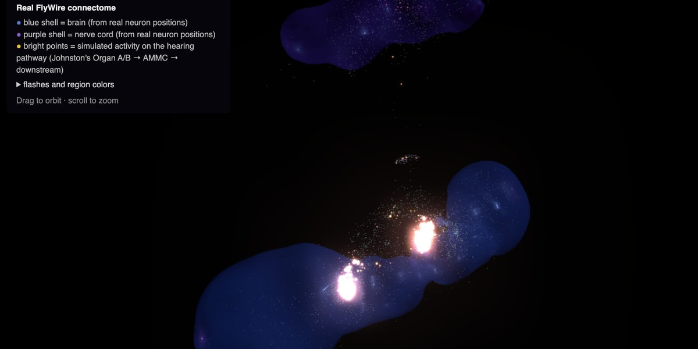
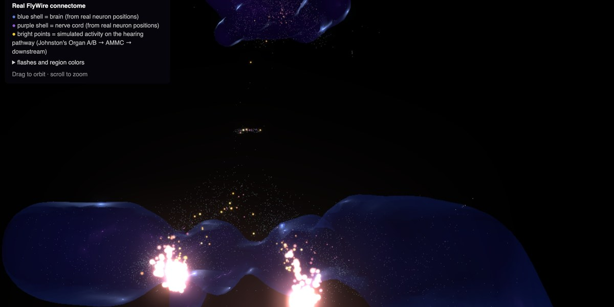
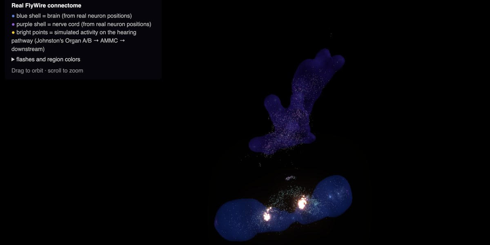
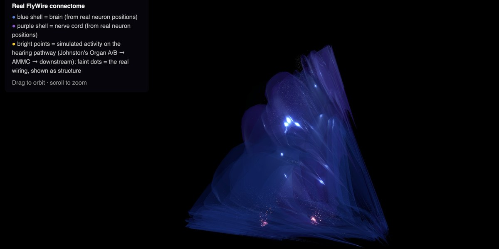
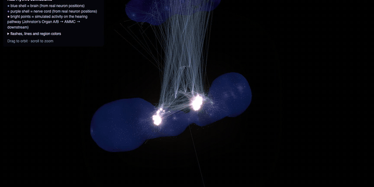

<div align="center">

# Fly Brain on Music

[](https://fly-brain-on-music-xbu8eqftdnxbxupgxbga8z.streamlit.app)     

</div>

Ever wondered what a fly's brain looks like while listening to music?

Start from the roughly 500 sound-sensitive neurons in a fruit fly's ear, follow the real wiring three steps out, and you reach about 10,800 neurons joined by about 30,000 real connections, from the brain's hearing centres down into the nerve cord. This project plays it music.

> The wiring is real. What the music means to it is not, and the project says so plainly.

The wiring diagram comes from [FlyWire](https://flywire.ai) and [CAVE](https://www.cave-connectome.org), a real map of one fly's brain and nerve cord down to the individual synapse ([BANC](https://www.nature.com/articles/s41586-026-10735-w), published in *Nature* in 2026). Drop in a track, and it drives a real simulation of neurons firing and passing signals to each other, using the same equations and settings that [a published brain model](https://www.nature.com/articles/s41586-024-07763-9) used on FlyWire's map of another fly's brain. The neurons are real. The synapses are real. What renders afterward is an interactive, audio-synced 3D scene, built from each neuron's true position in the brain.

The one part that is not science is the bridge from sound to synapse. No dataset of a fly's real neural response to music exists, so that mapping, loudness and onset and frequency energy translated into synaptic current, is an artistic choice, not a validated model. Call this connectome-constrained generative art, not a claim about how flies hear Chopin. The app's own "About this project" panel draws the line between the two, item by item.

<p align="center">
  <a href="https://fly-brain-on-music-xbu8eqftdnxbxupgxbga8z.streamlit.app"><b>Try it live</b></a>
</p>

<p align="center">
  
</p>

<table align="center">
  <tr>
    <td></td>
    <td></td>
  </tr>
</table>

<table align="center">
  <tr>
    <td></td>
    <td></td>
  </tr>
</table>

<p align="center">
  
</p>

## What's real vs. speculative

**Real, from published data:**
- **The wiring.** Real neurons, real synapses, real 3D positions, all from the FlyWire/CAVE map of a fly brain. Specifically, every neuron within three steps downstream of the sound-sensitive neurons in the fly's ear (Johnston's Organ subgroups A and B). [Read about the dataset](https://www.cave-connectome.org)
- **Which neurons excite and which calm things down.** Each neuron's chemical signal type decides whether it switches other neurons on or off, following the same rules the actual research uses. [Read the paper](https://www.nature.com/articles/s41586-024-07763-9)
- **How neurons fire.** A real, published model of how a neuron builds up charge and fires, run by actual researchers on FlyWire's brain map of another fly, reused here on BANC. [Read the paper](https://www.nature.com/articles/s41586-024-07763-9)

**Speculative, our own modeling layer:**
- **How hard the ear neurons are driven, and what the glow shows.** The drive strength is our own choice, set so the ear neurons fire at tens of spikes per second on typical music. Bright points are each neuron's simulated voltage against its own range; most real spiking stays near the ear, and the faint dots further out are the wiring, not activity.
- **Turning sound into a signal the neurons receive.** No one has ever measured how a fly's brain actually responds to music, so this mapping (how loud, how sudden, which pitches) is our own artistic choice, not a validated model. "Which pitches" comes from a mel spectrogram (frequency bins spaced denser at low pitches, sparser at high, the same shape as real cochlear tuning) with log compression, instead of a plain linear-frequency FFT. Transients (drum hits, plucks) are detected per frequency band rather than once for the whole mix, so a kick drum and a cymbal hit can trigger independently. The mix is also split into percussive and harmonic components before feature extraction (drums vs. sustained tones), which shapes two different response characters: sharp/transient for percussive-heavy moments, smoother/sustained for harmonic ones.
- **Splitting 8 frequency bands across different neurons.** The public data has no record of which neurons respond to which pitch, so this grouping is made up, just consistent every time you run it. A second, independent 12-way grouping (by pitch class, C through B, from chroma analysis) sits alongside it, so a chord change can visibly shift the response even when loudness and frequency-band energy stay flat.
- **Optional beat-synced timing.** Off by default, toggleable in the app. Instead of stepping the simulation at a fixed wall-clock rate, this locks frames to the track's own detected beat, so activation can pulse with the actual musical pulse rather than an arbitrary clock. Needs a real, steady beat to make sense, so it silently falls back to fixed-rate timing on material with too few detected beats (very short clips, silence).

## Try it

**[Open the live app](https://fly-brain-on-music-xbu8eqftdnxbxupgxbga8z.streamlit.app)**. A public-domain recording of Chopin's *Nocturne in E-flat major* is bundled in, so hit **Run simulation** and nothing more is required. White and pink noise are there too, for anyone who wants to see the thing twitch before trusting it with real music.

## Running locally

```bash
python3 -m venv venv
source venv/bin/activate
pip install -r requirements.txt
streamlit run src/app.py
```

The FlyWire connectome subgraph, neuron positions, and demo audio are already included in `data/`, so this works immediately. No CAVE account or auth token is needed just to run the app.

## Regenerating the data from scratch

Only needed if you want to rebuild the connectome subgraph yourself (different hop radius, synapse threshold, etc.) rather than use what's committed in `data/connectome/`.

```bash
pip install -r requirements-pipeline.txt
python src/get_token.py          # one-time: FlyWire/CAVE auth token
python src/check_auth.py         # verify it worked
python src/fetch_connectome.py   # pull the auditory-pathway subgraph
python src/fetch_coordinates.py  # real 3D neuron positions
python src/fetch_background_positions.py
python src/fetch_hull_meshes.py
```

Requires your own FlyWire/CAVE account. See [codex.flywire.ai](https://codex.flywire.ai).

## How it works

1. **`audio_features.py`** listens to the track: how loud, how fast, how sudden each moment is, its energy across 8 mel-spaced frequency bands (log-compressed, cochlear-style spacing, low to high) with per-band transient detection, its energy across 12 pitch classes (chroma), and the percussive/harmonic balance of each moment. Frames can be spaced at a fixed rate or (optionally) locked to the track's detected beat.
2. **`simulate.py`** feeds that into the real wiring diagram. About 10,800 neurons pass the signal to each other, hop by hop, starting from the sound-sensitive Johnston's Organ neurons (subgroups A and B) and spreading outward. In practice most of the spiking stays in the ear neurons and their first relays; further out the model shows small sub-threshold voltage changes, and the [2026-10-05 notes](#2026-10-05-hearing-only-rebuild) below explain why. Seed neurons are split two independent ways -- by frequency band and by pitch class -- so different populations respond to different pitches and different notes. The module's own comments walk through the model in more depth for anyone curious.
3. **`web_scene.py`** and **`brain_map_3d.py`** draw the result: each neuron placed at its real position in the brain, glowing brighter as it fires, in sync with the track. Brightness is normalized per neuron against its own range over the track (with a 2 mV minimum, so tiny wiggles stay dark), and every neuron on the pathway keeps a faint base color by its real BANC region (hearing centres, nerve cord, motor neurons and so on) so the wiring stays visible even where nothing is firing. Spikes show as flashes at each neuron's simulated firing rate, and real connections are drawn as faint lines: ear to first relay, the strongest next links, and the strongest real path from the ear to every leg and wing motor neuron. A pulse runs along a line when its source neuron spikes.
4. **`brain_map.py`** is a simple flat backup drawing (not the real 3D positions), kept on hand in case the real scene ever isn't wanted or available. It isn't part of the running app.

## Build story

It started as scaffolding only: pull a connectome, drive it with sound, see what happens. What actually happened was a season of dead ends and a few real discoveries that reshaped the project more than the original plan ever did.

Data access came first and refused to cooperate. CAVEclient authentication against FlyWire's production dataset was the intended path; it stalled, so the connectome got pulled by manual download instead, and the first real graph was built from that. Around the same time, an early assumption that audio files would live pre-stored, one per genre, got scrapped for a plain drag-and-drop uploader. Nothing stored, anyone's track welcome.

The visualization was a guess before it was a fact. With no 3D mesh data available from the public export, the first rendering was a hand-authored schematic, still alive today as `brain_map.py`, a fallback rather than the centerpiece it once had to be. The real thing turned up later in CAVE's `cell_representative_point` table: the true anatomical position of every neuron, sitting there the whole time, which is what finally unblocked a real 3D scene.

The single biggest improvement, by the development log's own account, was switching to real leaky integrate-and-fire dynamics. The activation model went through a generic recurrence formula and a few tanh-squashed approximations before landing on an actual LIF spiking model, then later adopting Shiu et al.'s exact published parameters for it, so the membrane time constant would be a number drawn from the literature and independently confirmed, not one picked because it looked reasonable.

Some of the fixes were real bugs, not just tuning: activation that snapped instantly instead of following the membrane dynamics, a centering bug from targeting a bounding box's midpoint instead of its center of mass, a simulation that worked fine on synthetic noise and stayed dead on real songs, and a geometry bug behind a brain hull shaped, for a while, like a blade. The auditory subgraph itself grew too, from two hops downstream of Johnston's Organ to three, the synapse-count threshold raised alongside it to keep the neuron count workable while reaching further into wiring that was real at every step.

What was left, once the simulation could be trusted, was making it legible: a Streamlit `session_state` bug that wiped the entire results view if you so much as touched another widget, a dark theme built to match the scene instead of clashing against Streamlit's default light UI, a loading indicator that nods to the real FlyWire and CAVE segmentation viewer, and finally moving the transport controls outside the 3D viewport instead of floating on top of it.

### 2026-10-05: hearing-only rebuild

An audit while adding the new BANC paper citation found that the "auditory pathway" had been seeded from every neuron in the antennal nerve. That nerve carries more than hearing: of its 4,502 neurons, 2,775 (62%) are olfactory receptors and only 1,192 belong to Johnston's Organ. So most of the network the music was driving was the fly's sense of smell, which is why the antennal lobe and mushroom body lit up so much.

What changed:

- **Seeds are now Johnston's Organ subgroups A and B only** (511 neurons), the sound-sensitive ones per Kamikouchi et al. 2009 and Yorozu et al. 2009. Subgroups C and E, which mainly sense gravity and wind, are left out.
- **Connection threshold lowered from 12 to 8 synapses**, since the smaller seed set leaves room: 10,771 neurons and 30,380 connections (was 22,878 and 75,947). Fresh 3D positions were pulled from CAVE for every neuron.
- **Spike counts checked, not just voltages.** On the Chopin demo at the old drive strength, ear neurons fired under 1 Hz on average and nothing downstream spiked at all. In the old smell-heavy network, the downstream activity came from many olfactory neurons converging on each relay. Drive strength was raised from 12 to 30 so the ear neurons fire at tens of Hz. Even so, spiking mostly stops after the first relay in this model.
- **Display made honest about that.** Each neuron now needs at least 2 mV of depolarization to reach full brightness (before, a 0.01 mV wiggle could be stretched to full glow), and every pathway neuron keeps a faint base tint so the real route, including into the nerve cord, is visible as wiring rather than implied activity.
- **Visual pass (same day).** The honest version looked flat, so four real-data visual layers were added: stronger bloom on activity only, wiring colored by BANC region, spike flashes at each neuron's simulated firing rate, and signal routes (real connections, with pulses when the source spikes). The routes reach every leg and wing motor neuron as structure; pulses mostly stay near the ears, because that's where the simulated spikes are.
- **Citation fix.** The Shiu et al. 2024 model was built on FlyWire's brain-only map of a different fly, not on BANC. The docs previously said "this same connectome". The BANC paper itself (Bates et al. 2026, *Nature*) is now cited too.

The unedited log lives in [`BUILD_LOG.md`](BUILD_LOG.md) if any of that is worth the full account.

## Credits

- Connectome data: [FlyWire](https://flywire.ai) / [CAVE](https://www.cave-connectome.org), BANC v888 dataset. Bates et al. 2026, *Nature*, "[Distributed control circuits across a brain-and-cord connectome](https://www.nature.com/articles/s41586-026-10735-w)."
- LIF model parameters: Shiu et al. 2024, *Nature*, "A *Drosophila* computational brain model reveals sensorimotor processing." Built on FlyWire's brain-only connectome (FAFB); its parameters are reused here on BANC, not re-fit.
- Hearing neuron subgroups: Kamikouchi et al. 2009, *Nature*, "The neural basis of *Drosophila* gravity-sensing and hearing"; Yorozu et al. 2009, *Nature*, "Distinct sensory representations of wind and near-field sound in the *Drosophila* brain."
- Neurotransmitter sign convention: Lappalainen et al. 2024, *Nature*; Hardie, 1989, *Nature*.
- Demo track: Chopin, *Nocturne in E-flat major, Op. 9 No. 2*, performed by Frank Levy, public domain (CC0) via [Wikimedia Commons](https://commons.wikimedia.org/wiki/File:Nocturneop9no2-.ogg).

## License

Code: MIT. See [LICENSE](LICENSE). The connectome data in `data/connectome/` is derived from FlyWire/CAVE and subject to [FlyWire's own data usage terms](https://codex.flywire.ai/api/download), not this repo's MIT license.

## Disclaimer

This is a speculative/artistic simulation, not a validated behavior predictor. The connectome and spiking model are real and cited; the audio-to-neuron-drive mapping and the resulting "behavior" are a modeling choice, not established science.

---

"I discovered in nature the nonutilitarian delights that I sought in art. Both were a form of magic, both were a game of intricate enchantment and deception." ― Vladimir Nabokov
